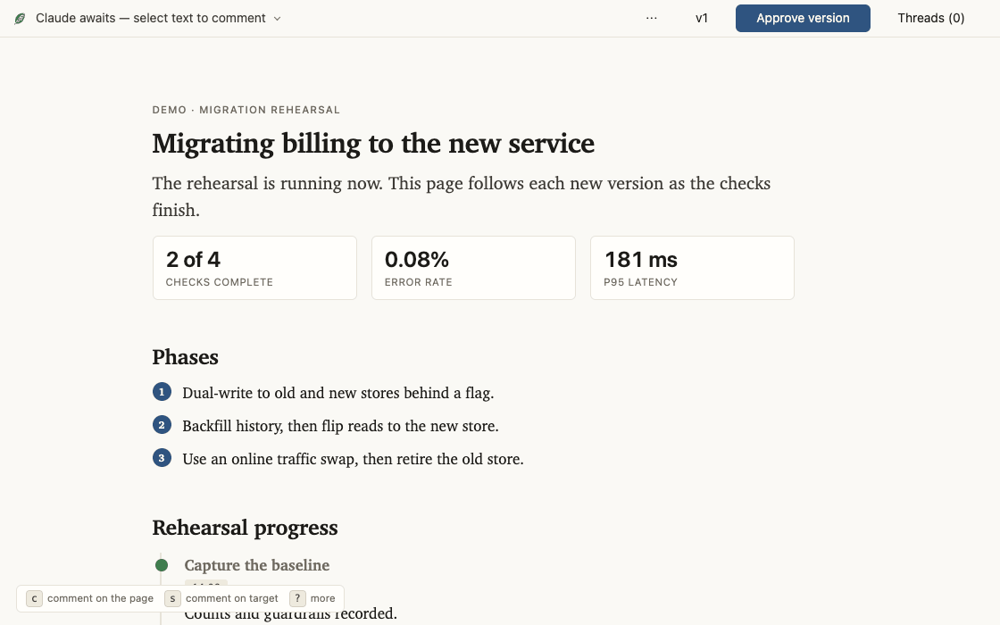

# leaf

[![maintained with tend](https://img.shields.io/badge/maintained_with-tend-bba580?logo=data:image/svg%2bxml;base64,PHN2ZyB4bWxucz0iaHR0cDovL3d3dy53My5vcmcvMjAwMC9zdmciIHZpZXdCb3g9IjAgMCAxNiAxNiI+PGcgdHJhbnNmb3JtPSJ0cmFuc2xhdGUoMCwxNikgc2NhbGUoMC4wMTI1LC0wLjAxMjUpIiBmaWxsPSIjZmZmIiBzdHJva2U9Im5vbmUiPjxwYXRoIGQ9Ik02ODAgMTEyOCBjNjIgLTk2IDY5IC0xNzggMjAgLTI0MSAtMTcgLTIyIC0yMCAtNDAgLTIwIC0xMzQgbDEgLTEwOCAyMSAyOCBjMTEgMTYgMzAgNDcgNDIgNzAgMTIgMjIgMzIgNDkgNDYgNTkgMzcgMjcgMTE0IDM4IDE4NCAyNyA5MyAtMTUgOTQgLTE4IDQ0IC03OSAtNzIgLTg4IC0xMDkgLTExMyAtMTc2IC0xMTcgLTMxIC0yIC02NCAxIC03MiA2IC0yMyAxNSAyMSA1NiAxMDcgOTggNDAgMjAgNzEgMzggNjkgNDAgLTYgNyAtODggLTE3IC0xMjYgLTM3IC00OSAtMjUgLTEwMCAtNzggLTEyMSAtMTI1IC0xNSAtMzMgLTE5IC02NiAtMTkgLTE4OCAwIC0xNTcgOCAtMTk1IDUwIC0yMzIgMTcgLTE2IDM2IC0yMCA4NSAtMTkgNjIgMSA2MyAxIDczIC0zMiA5IC0zMiA5IC0zMyAtMjIgLTQwIC01MCAtMTIgLTEzMiAtNyAtMTY0IDEwIC00MCAyMSAtNzkgNjkgLTkyIDExNCAtNSAyMCAtMTAgMTAyIC0xMCAxODIgMCA4MCAtNSAxNjIgLTExIDE4NCAtMjIgNzkgLTEzNSAxNjYgLTIzNCAxODEgLTM3IDYgLTM1IDMgMzAgLTI4IDc4IC0zOSAxNDQgLTkxIDEzMiAtMTA0IC01IC00IC0zNyAtOCAtNzEgLTggLTc3IDAgLTExNyAyNCAtMTgyIDEwOSAtNTIgNjggLTUxIDcwIDQyIDg1IDcxIDExIDE0MyAwIDE4MyAtMjkgMTYgLTExIDQwIC00MyA1NCAtNzMgMTMgLTI5IDMyIC01OSA0MSAtNjYgMTQgLTEyIDE2IC03IDE2IDU4IDAgNTkgNCA3NyAyMyAxMDIgMTkgMjYgMjMgNDYgMjUgMTMwIDMgNjcgMCA5OSAtNyA5OSAtNyAwIC0xMSAtMjMgLTEyIC01NyAwIC0zMiAtNiAtNzYgLTEyIC05NyBsLTEyIC00MCAtMjcgMzIgYy0zNCA0MSAtNDMgOTYgLTI0IDE1MSAxNCA0MSA3NSAxNDEgODYgMTQxIDMgMCAyMSAtMjQgNDAgLTUyeiIvPjwvZz48L3N2Zz4K)](https://github.com/max-sixty/tend)

> **Not ready for general use.** Watch this space, and hopefully there'll be more to
> say soon.

Generative UI for agents: the agent builds you the page rather than a scroll of
terminal text — a plan whose options you press to decide, a triage board you drag, a
dashboard that keeps up while a long job runs. When the project needs a widget that
doesn't exist, the agent writes one, and the same theme and checks cover it.

Underneath is a messaging and collaboration bus. Select any line and comment on it
like a shared doc, or drag a card, or rewrite a draft in your own words: it all
reaches the session as structured events, and the agent answers in the margin and
updates the page. You can also answer with one press: `ok` `no` `lost` `cut` `more`.
Every valid save becomes a live revision; meaningful checkpoints become immutable
stamped versions. The browser follows along on its own. Leaf is a plugin —
Claude Code and Codex so far.



<https://leaf.page/> is the tour, the mechanism, the example pages, and the guide to
themes and project widgets. Each page uses leaf's own theme, so they double as
specimens, and each opens the same from a checkout ([`docs/`](docs/)) as from the web.

## Install

Claude Code:

```
/plugin marketplace add max-sixty/leaf
/plugin install leaf@leaf
```

Codex:

```
codex plugin marketplace add max-sixty/leaf
codex plugin add leaf@leaf
```

No config or account is required. It needs
[`uv`](https://docs.astral.sh/uv/) and
[`jq`](https://jqlang.github.io/jq/download/) 1.6 or newer on `PATH` (`interact.py`
declares its Python dependencies in a PEP 723 header, and `uv` resolves them through
whatever index you have already configured), plus a browser on the same machine as the
session.

Then ask the agent for a page. The explicit skill is `/leaf [topic]` in Claude Code
and `$leaf [topic]` in Codex; with no argument it presents whatever the session is
currently about.

## Packages

A package is a directory that can supply a theme, one widget, a related family,
helper modules, vendor files, typed external-data contracts, or guidance for named
audiences. Leaf's included content widgets are a bundled default package. Command Hub
is an optional bundled package. Project and user packages live at `.leaf/` and
`~/.config/leaf/`.

Leaf creates and checks the package as one unit:

```
leaf package init packages/callout
# edit its registry, theme, guidance/, and modules
leaf package check packages/callout
```

`package init` creates the common files and directories without replacing anything
already present. An explicit package joins a page by path:

```
leaf page init --package packages/callout <page-dir>
```

An optional bundled package joins by name:

```
leaf page init --package command-hub <page-dir>
```

The page records package selections and their order in its vendored registry, so a
later plain `page init` reproduces the composition. A bare package name selects a
bundled package; use `./name` for a same-shaped project path. Other paths are relative
to the project or start with `~`; absolute paths are refused because the registry is
public.
Later explicit packages win collisions, followed by the user package and then the
project package. `page init --no-packages` clears the explicit list.

The [package guide](docs/packages.html) covers the directory contract and
precedence.

## Examples

[`examples/`](examples/) holds a complete page for each kind of work, including a
dashboard meant to change as work finishes. They are live at
<https://leaf.page/examples.html>, and `gallery.html` puts them on one page as tabs.
