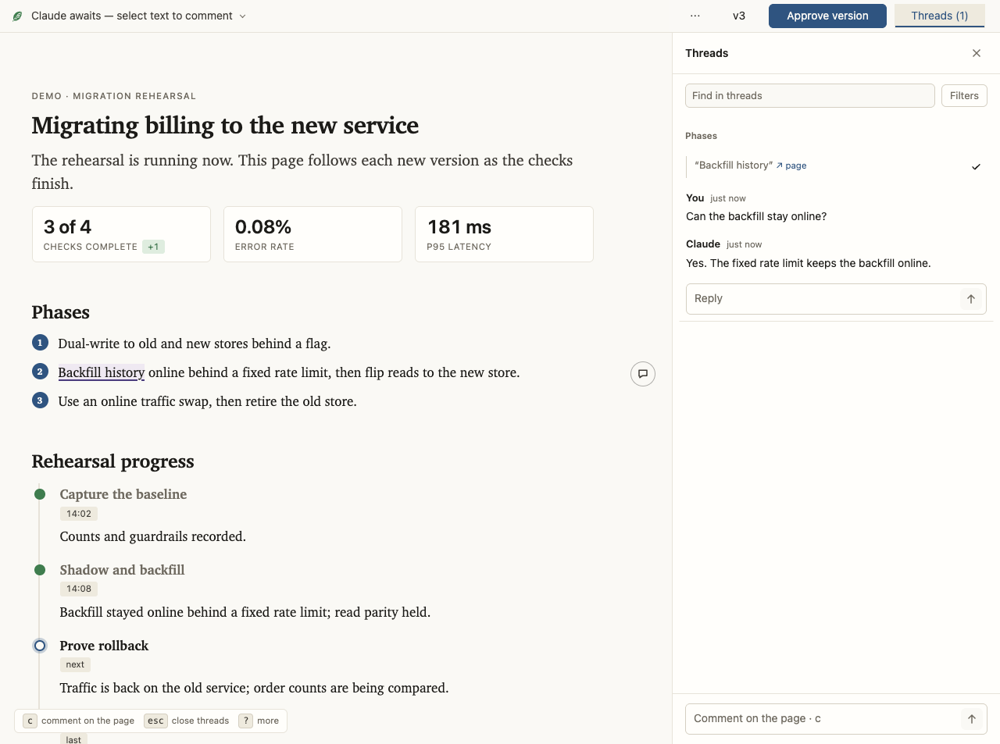

# leaf

[![maintained with tend](https://img.shields.io/badge/maintained_with-tend-bba580?logo=data:image/svg%2bxml;base64,PHN2ZyB4bWxucz0iaHR0cDovL3d3dy53My5vcmcvMjAwMC9zdmciIHZpZXdCb3g9IjAgMCAxNiAxNiI+PGcgdHJhbnNmb3JtPSJ0cmFuc2xhdGUoMCwxNikgc2NhbGUoMC4wMTI1LC0wLjAxMjUpIiBmaWxsPSIjZmZmIiBzdHJva2U9Im5vbmUiPjxwYXRoIGQ9Ik02ODAgMTEyOCBjNjIgLTk2IDY5IC0xNzggMjAgLTI0MSAtMTcgLTIyIC0yMCAtNDAgLTIwIC0xMzQgbDEgLTEwOCAyMSAyOCBjMTEgMTYgMzAgNDcgNDIgNzAgMTIgMjIgMzIgNDkgNDYgNTkgMzcgMjcgMTE0IDM4IDE4NCAyNyA5MyAtMTUgOTQgLTE4IDQ0IC03OSAtNzIgLTg4IC0xMDkgLTExMyAtMTc2IC0xMTcgLTMxIC0yIC02NCAxIC03MiA2IC0yMyAxNSAyMSA1NiAxMDcgOTggNDAgMjAgNzEgMzggNjkgNDAgLTYgNyAtODggLTE3IC0xMjYgLTM3IC00OSAtMjUgLTEwMCAtNzggLTEyMSAtMTI1IC0xNSAtMzMgLTE5IC02NiAtMTkgLTE4OCAwIC0xNTcgOCAtMTk1IDUwIC0yMzIgMTcgLTE2IDM2IC0yMCA4NSAtMTkgNjIgMSA2MyAxIDczIC0zMiA5IC0zMiA5IC0zMyAtMjIgLTQwIC01MCAtMTIgLTEzMiAtNyAtMTY0IDEwIC00MCAyMSAtNzkgNjkgLTkyIDExNCAtNSAyMCAtMTAgMTAyIC0xMCAxODIgMCA4MCAtNSAxNjIgLTExIDE4NCAtMjIgNzkgLTEzNSAxNjYgLTIzNCAxODEgLTM3IDYgLTM1IDMgMzAgLTI4IDc4IC0zOSAxNDQgLTkxIDEzMiAtMTA0IC01IC00IC0zNyAtOCAtNzEgLTggLTc3IDAgLTExNyAyNCAtMTgyIDEwOSAtNTIgNjggLTUxIDcwIDQyIDg1IDcxIDExIDE0MyAwIDE4MyAtMjkgMTYgLTExIDQwIC00MyA1NCAtNzMgMTMgLTI5IDMyIC01OSA0MSAtNjYgMTQgLTEyIDE2IC03IDE2IDU4IDAgNTkgNCA3NyAyMyAxMDIgMTkgMjYgMjMgNDYgMjUgMTMwIDMgNjcgMCA5OSAtNyA5OSAtNyAwIC0xMSAtMjMgLTEyIC01NyAwIC0zMiAtNiAtNzYgLTEyIC05NyBsLTEyIC00MCAtMjcgMzIgYy0zNCA0MSAtNDMgOTYgLTI0IDE1MSAxNCA0MSA3NSAxNDEgODYgMTQxIDMgMCAyMSAtMjQgNDAgLTUyeiIvPjwvZz48L3N2Zz4K)](https://github.com/max-sixty/tend)

> **Experimental software; not ready for general use.**

Leaf is generative UI for Claude Code and Codex. Review a plan, make a decision,
or follow live work in a page you can comment on and change. The agent responds by
revising the page.

<picture>
  <source media="(prefers-color-scheme: dark)" srcset="docs/session-dark.png">
  
</picture>

<details>
<summary>Watch the comment-and-revision loop</summary>


</details>

[Try Leaf on the home page](https://leaf.page/), where Leaf guide responds in your
private copy, or [explore the examples](https://leaf.page/examples/).

## Install

You need [`uv`](https://docs.astral.sh/uv/),
[`jq`](https://jqlang.github.io/jq/download/) 1.6 or newer on `PATH`, and a
browser on the same machine as your agent. No Leaf account or configuration is
required.

Claude Code:

```
/plugin marketplace add max-sixty/leaf
/plugin install leaf@leaf
```

Codex:

```
codex plugin marketplace add max-sixty/leaf
codex plugin add leaf@leaf
```

Then ask: “Use Leaf to write up the options for this change.” The explicit skill is
`/leaf [topic]` in Claude Code and `$leaf [topic]` in Codex; without a topic, it
presents the work already under discussion.
The result opens in a browser page; its comments return to the same agent task.

<details>
<summary>Browser and environment requirements</summary>

The first run syncs the plugin's uv environment through your configured package
index. Render checks and export use the executable named by
`LEAF_BROWSER_EXECUTABLE`, `CHROME_PATH`, or `CHROME_BIN`, then installed Google
Chrome, then the first `google-chrome`, `google-chrome-stable`, `chrome`,
`chromium`, or `chromium-browser` on `PATH`. Export requires Chromium 125 or
later.

</details>

## Explore and extend

- [How it works](https://leaf.page/how-it-works/): comments, decisions, live
  revisions, and the widgets a page can use.
- [Examples](https://leaf.page/examples/): proposals, editable drafts, release
  workspaces, and code reviews.
- [Packages](https://leaf.page/packages/): extend Leaf with reusable widgets,
  themes, and browser modules. Your agent can build a widget a task needs and use
  it in later pages.
- [Public contracts](skills/leaf/SKILL.md): authoring, serving, and continuing a
  Leaf page. The [experimental MCP App](skills/leaf/scripts/leaf/mcp-app.md)
  provides an additional host integration.
